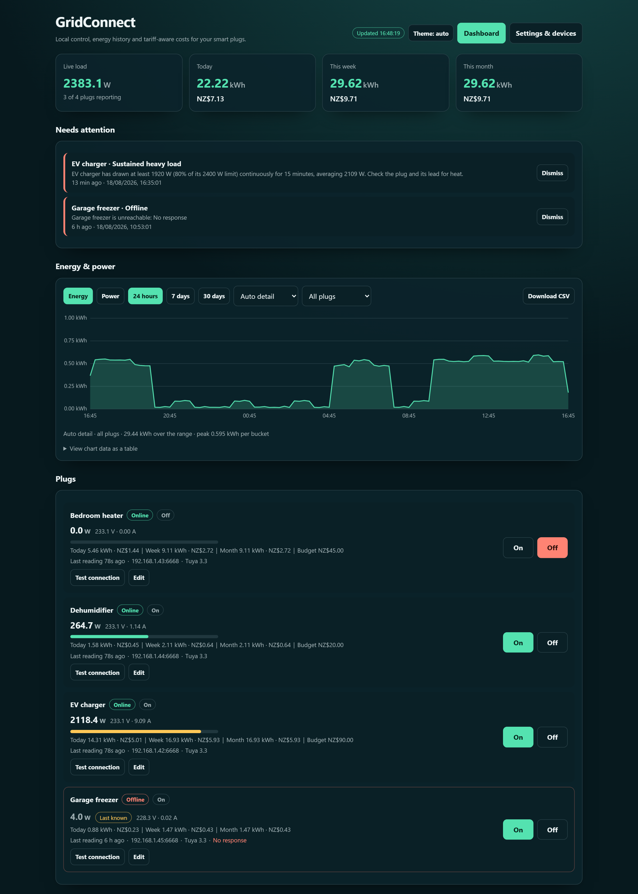

# GridConnect

GridConnect is a small, local-first dashboard for Tuya-derived smart plugs, including compatible Arlec Grid Connect devices sold in Australia and New Zealand. It polls plugs directly over the LAN, stores energy history in SQLite, provides local on/off control and schedules, and estimates plug energy costs without Home Assistant or an ongoing cloud subscription.



The device integration is built on the open-source [TinyTuya](https://github.com/jasonacox/tinytuya) Python library. TinyTuya provides the local Tuya LAN communication and Tuya Cloud setup calls used for device polling, control, protocol detection, and credential import. This project adds the Docker service, SQLite history, tariff calculations, automations, monitoring APIs, and browser dashboard around it.

This is an independent community project. It is not affiliated with or endorsed by Arlec,
Grid Connect, or Tuya.

> **Safety note.** Consumer smart plugs carry a peak rating (commonly 10 A / 2400 W) that
> is not the same as a continuous rating. Running one near its limit for hours — EV
> charging, heaters, dryers — heats the plug and its contacts, and heat is a common cause
> of both plug failure and the Wi-Fi module dropping offline. GridConnect can warn you
> about this (see **Sustained heavy load** below), but a warning is not a substitute for
> using equipment within its rating. Check the plug manufacturer's guidance before using
> a smart plug for a high continuous load.

The application runs as one Docker container on Windows, Linux, Unraid, a NAS, a mini PC, or a 64-bit Raspberry Pi. After a device's local credentials have been obtained, normal polling and control remain local.

## Features

- Live watts, voltage, current, switch state, and online status.
- Energy and cost totals for today, this week, and this month.
- Interactive 24-hour, 7-day, and 30-day charts.
- Per-device filtering and CSV export.
- Flat or peak/off-peak energy tariffs with AU/NZ-style GST handling.
- Configurable polling interval and raw-data retention.
- Local on/off control, one-off timers, and weekly schedules.
- Bounded automation retries and an automation execution log.
- Device renaming, protocol detection, and full DPS/scaling controls for every metering channel.
- A live **DPS channel inspector** that reads a plug's raw values so a wrong metering
  mapping can be corrected without guesswork.
- Alerting for offline plugs, peak watts, **sustained heavy load**, out-of-range supply
  voltage, and monthly spend budgets.
- Light and dark themes that follow the system setting, and an installable PWA.
- Archive-first device removal so history is not deleted accidentally.
- SQLite backup and validated in-place restore.
- Compact widget and health APIs for dashboards and Uptime Kuma.
- No Home Assistant, MQTT broker, or external database required.

Costs intentionally include only energy consumed by the configured plugs. Household supply charges and unrelated retailer fees are not included.

## Requirements

- Docker Engine with Docker Compose v2, or Docker Desktop on Windows.
- An always-on host connected to the same routed home network as the plugs.
- A reserved LAN IP, Tuya device ID, local key, and supported protocol for each plug.
- TCP access from the host to each plug on port `6668`.

Do not deploy this on an internet VPS. Tuya LAN devices are intended to be reached from the local network.

## Quick installation

These instructions work without modification on normal Linux Docker hosts, Unraid, most NAS platforms, Raspberry Pi, and usually Docker Desktop.

1. Copy or download this project to the Docker host.
2. Copy `.env.example` to `.env`.
3. Edit `.env` and set the timezone if required:

   ```dotenv
   GRIDCONNECT_TIMEZONE=Pacific/Auckland
   GRIDCONNECT_NETWORK_MODE=bridge
   GRIDCONNECT_AUTH_PASSWORD=
   ```

4. From the project directory, build and start the service:

   ```console
   docker compose up --build -d
   ```

5. Open `http://HOST-IP:8080`. On the same machine, use `http://localhost:8080`.
6. Open **Settings & devices**, configure the tariff, and add the first plug.

Persistent data is stored in `./data/gridconnect.db`. The container can be rebuilt or replaced without losing configuration or readings as long as the `data` directory is retained.

### Common Docker commands

```console
# View status
docker compose ps

# Follow logs
docker compose logs -f gridconnect-energy

# Rebuild after an update
docker compose up --build -d

# Stop the service without deleting its data
docker compose down
```

## Platform notes

### Linux, Raspberry Pi, Unraid, and NAS

Regular Docker bridge networking should be sufficient. Keep:

```dotenv
GRIDCONNECT_NETWORK_MODE=bridge
```

Publish container port `8080`, mount a persistent directory at `/data`, and make sure the host firewall permits connections to the plugs on TCP `6668`.

If a particular Linux network setup prevents bridge containers from reaching LAN clients, `GRIDCONNECT_NETWORK_MODE=host` is a simple fallback. Host networking is normally unnecessary.

For NAS application screens that do not use Compose, use these equivalent values:

| Setting          | Value                                   |
| ---------------- | --------------------------------------- |
| Build context    | This project directory                  |
| Container port   | `8080/tcp`                              |
| Host port        | `8080`                                  |
| Persistent mount | Host folder mapped to `/data`           |
| Timezone         | `GRIDCONNECT_TIMEZONE=Pacific/Auckland` |
| Database         | `GRIDCONNECT_DB=/data/gridconnect.db`   |
| Restart policy   | `unless-stopped`                        |

The Python base image and application support both `amd64` and `arm64` Docker hosts.

### Windows with Docker Desktop

Start with the normal quick installation and bridge mode. Many Docker Desktop installations can reach LAN plugs without additional work.

Some Windows Wi-Fi, router, and Docker Desktop combinations allow Windows itself to connect to a plug while the Docker Linux VM cannot. Test both paths in PowerShell:

```powershell
Test-NetConnection 192.168.1.42 -Port 6668
docker exec gridconnect-energy python -c "import socket; socket.create_connection(('192.168.1.42', 6668), 3); print('reachable')"
```

Replace `192.168.1.42` with the plug's reserved address. If Windows succeeds but the container fails, use the included Windows TCP relay described below.

The TCP relay is a Docker Desktop workaround. It is not required for Linux, Raspberry Pi, Unraid, or normal NAS deployments.

## Windows Docker Desktop TCP relay

`host-relay.py` is a small transparent TCP bridge. It forwards encrypted Tuya LAN traffic from Docker Desktop to a plug. It does not contain device IDs or local keys.

### 1. Create the relay configuration

Copy the example:

```powershell
Copy-Item relay-config.example.json relay-config.json
```

Edit `relay-config.json` and add one route per plug. Each plug needs a different local listening port:

```json
{
  "bind_host": "0.0.0.0",
  "allowed_networks": ["127.0.0.0/8", "192.168.65.0/24", "172.16.0.0/12"],
  "routes": [
    {
      "listen_port": 16668,
      "target_host": "192.168.1.42",
      "target_port": 6668
    },
    {
      "listen_port": 16669,
      "target_host": "192.168.1.43",
      "target_port": 6668
    }
  ]
}
```

Use DHCP reservations so the target addresses do not change. The allowed networks restrict the listener to loopback and typical Docker-private address ranges.

### 2. Start the relay on Windows

The relay uses only Python's standard library and works with Python 3.11 or newer:

```powershell
python .\host-relay.py
```

Allow the Python process on private networks if Windows Firewall prompts. Keep this process running whenever Arlec Plug Monitor needs the affected plugs. Its log is written to `relay.log`.

To start it without a visible console window:

```powershell
Start-Process python -ArgumentList '-u', "$PWD\host-relay.py" -WorkingDirectory $PWD -WindowStyle Hidden
```

For an always-on installation, create a Windows Task Scheduler entry that runs the same command at sign-in or system startup.

### 3. Configure the device in the dashboard

When importing or manually adding the plug, use:

| Field                   | Value                                          |
| ----------------------- | ---------------------------------------------- |
| LAN IP / relay host     | `host.docker.internal`                         |
| Tuya TCP port           | The route's `listen_port`, for example `16668` |
| Device ID and local key | The plug's real Tuya credentials               |

The dashboard's protocol check works through the relay and selects the first compatible Tuya LAN protocol automatically.

### 4. Test the relay

From Windows:

```powershell
Test-NetConnection localhost -Port 16668
```

From the container:

```powershell
docker exec gridconnect-energy python -c "import socket; socket.create_connection(('host.docker.internal', 16668), 3); print('relay reachable')"
```

If the relay is reachable but the plug remains offline, verify the target IP, confirm the plug is connected to Wi-Fi, and check whether re-pairing changed its local key.

## Obtaining Tuya local credentials

Each device requires:

- A reserved LAN IP address.
- Tuya device ID.
- Tuya local key.
- Protocol version, usually `3.1` through `3.5`.

The dashboard can retrieve linked devices from a Tuya IoT Cloud project during setup. Cloud access credentials are used only for that request and are not stored. The resulting device ID and local key must be stored locally because they are required for LAN polling.

For Tuya Smart or Smart Life devices, link the app account to a Tuya IoT Platform project. Grid Connect accounts may also be linkable depending on the account and device firmware. If a Grid Connect device cannot be retrieved, temporarily pairing it in Tuya Smart or using TinyTuya's supported setup wizard is usually the simplest route.

Removing and re-pairing a plug normally changes its local key. Update the saved device if it suddenly stops authenticating.

Never publish local keys, `relay-config.json`, `.env`, or `data/gridconnect.db`.

## Adding a device

1. Reserve the plug's IP address in the router.
2. Open **Settings & devices**.
3. Use **Find linked devices** for a Tuya IoT project, or open **Manual add / advanced DPS**.
4. Enter the real plug IP and port `6668`. For the Windows relay, use `host.docker.internal` and the assigned relay port.
5. Run the protocol test. The app checks Tuya protocols `3.1` through `3.5`.
6. Add the plug and confirm that it becomes **Online** and reports plausible measurements.

The API prevents the same Tuya device ID from being added twice.

## DPS values and scaling

Tuya energy plugs do not all use the same DPS fields. The defaults are common but may need adjustment:

| Reading or control | Default DPS | Default scale |
| ------------------ | ----------: | ------------: |
| Switch             |         `1` |             — |
| Energy counter     |        `17` |    `0.01` kWh |
| Current            |        `18` |     `0.001` A |
| Watts              |        `19` |       `0.1` W |
| Voltage            |        `20` |       `0.1` V |

If readings are missing or implausible, open **Settings & devices > Plugs** and choose
**Inspect channels** on the plug. That reads the plug's live DPS map, shows the raw value
of every channel alongside a guess at what it represents, and lets you assign channels to
roles and apply the mapping directly.

A plug reporting `0 W` while a load is plainly connected almost always means the watts
channel is mapped to a DPS the plug does not use. A voltage far outside your supply's
normal range usually means the voltage scale is wrong rather than the supply being at fault.

Energy history is calculated from positive changes in the plug's cumulative energy counter. If that counter resets after a reboot, the reset interval is discarded and accumulation continues from the new baseline.

## Tariffs

Set prices in cents per kWh. When **Prices include GST** is disabled, the dashboard adds 15% GST to estimated plug-energy costs.

For peak/off-peak pricing, enter periods as JSON. Days use Monday `0` through Sunday `6`:

```json
[
  {
    "name": "Peak",
    "days": [0, 1, 2, 3, 4],
    "start": "07:00",
    "end": "23:00",
    "rate_cents": 35
  },
  {
    "name": "Off peak",
    "days": [0, 1, 2, 3, 4, 5, 6],
    "start": "23:00",
    "end": "07:00",
    "rate_cents": 22
  }
]
```

Overnight periods are supported. Tariff calculations use the configured IANA timezone, such as `Pacific/Auckland` or `Australia/Sydney`.

## Alerts

GridConnect raises alerts on the dashboard and keeps them open until the condition clears.

| Alert                    | Raised when                                                                 |
| ------------------------ | --------------------------------------------------------------------------- |
| **Offline**              | A plug has not answered for longer than the offline threshold                 |
| **Over watt limit**      | A single reading exceeds the plug's watt limit                                |
| **Sustained heavy load** | A plug stays above a share of its watt limit for the whole configured window  |
| **Unexpected voltage**   | Reported voltage falls outside the nominal supply band                        |
| **Budget reached**       | This month's cost for a plug reaches its monthly budget                       |
| **Schedule / timer failed** | An automation could not reach the plug                                     |
| **Service problem**      | A background task failed; the service keeps running and retries              |

### Sustained heavy load

Set a **watt limit** on the plug (its rating is a sensible value), then configure the window
and threshold under **Settings > General & tariff > Alerts**. With the defaults, a plug that
stays above 80% of its limit for 15 minutes straight raises an alert. Brief inrush peaks are
ignored, and a window that dipped below the line at any point does not count — this is aimed
at the long, hot, continuous draw rather than at momentary spikes.

### Unexpected voltage

Configure your nominal supply voltage and tolerance. Readings outside the band are far more
often a wrong `voltage_scale` than a genuine supply problem, so the alert text says so; use
**Inspect channels** to confirm.

## Timers and schedules

- One-off timers are stored in SQLite and run locally.
- Failed timers retry at most three times with increasing delays.
- Weekly schedules are claimed before execution, preventing a failure from firing repeatedly during the same minute.
- Every attempt is recorded under **Automation history**.

Vendor-app schedules continue to run independently. Disable duplicate Grid Connect, Tuya Smart, or Smart Life automations if they conflict with a local schedule.

## Backups and upgrades

The simplest backup is **Settings & devices → Download SQLite backup**. The resulting file contains settings, device credentials, schedules, and history, so treat it as sensitive.

The restore control validates SQLite integrity, pauses polling, replaces the database, runs forward migrations, and resumes without a manual container restart.

Before an upgrade:

1. Download a database backup.
2. Retain `.env`, `relay-config.json`, and the `data` directory.
3. Replace or update the application files.
4. Run:

   ```console
   docker compose up --build -d
   ```

Database migrations are forward-only and run automatically at startup.

## Monitoring and API endpoints

| Endpoint                   | Purpose                                             |
| -------------------------- | --------------------------------------------------- |
| `GET /api/health`          | Service status plus healthy/degraded device summary |
| `GET /api/health/devices`  | Per-device health information                       |
| `GET /api/widgets/summary` | Live watts and today's energy/cost for widgets      |
| `GET /api/trends`          | JSON chart data                                     |
| `GET /api/trends.csv`      | CSV chart export                                    |
| `GET /api/overview`        | Dashboard payload: devices, totals, alerts, live watts |
| `POST /api/devices/{id}/dps`  | Read a plug's raw DPS channels for mapping       |
| `POST /api/devices/{id}/test` | Force an immediate poll and store the reading    |
| `POST /api/maintenance/check-budgets` | Re-evaluate budget alerts now            |

For Uptime Kuma, monitor `http://HOST-IP:8080/api/health`. HTTP `200` means the service and database are available; inspect the JSON `status` field if device degradation should generate a separate alert.

## Security

This is a LAN-first service and does not enable authentication by default. To require a password, set:

```dotenv
GRIDCONNECT_AUTH_PASSWORD=replace-with-a-long-random-password
```

The username is `gridconnect`. Basic authentication should only be used on a trusted LAN or behind an HTTPS reverse proxy. Do not expose port `8080` directly to the public internet.

The unauthenticated health endpoint remains available for monitoring. Device local keys are stored in SQLite and are never returned by normal device-list APIs.

## Troubleshooting

### Device shows offline

1. Confirm the plug is powered and connected to Wi-Fi.
2. Confirm its DHCP reservation and saved address.
3. Test TCP `6668` from the Docker host.
4. On Docker Desktop, test from inside the container and use the Windows relay if only the host can connect.
5. Check whether the device was re-paired and received a new local key.
6. Run **Test connection** in the dashboard and inspect `docker compose logs`.

### Values are missing or incorrectly scaled

Edit the device and verify the watts, voltage, current, and energy DPS values. A reading that is ten or one hundred times too large usually indicates an incorrect scale.

### Dashboard is available but health says degraded

`ok: true` indicates the web service and database are working. `status: degraded` indicates that one or more enabled plugs are offline. Query `/api/health/devices` for details.

### Database is growing

Raw readings are retained for 90 days by default and then rolled into hourly totals. Change **Raw sample retention** in Settings, or run the retention roll-up manually.

## Development

Python 3.12 or newer and Node.js 20 or newer are recommended.

```powershell
python -m venv .venv
.\.venv\Scripts\Activate.ps1
pip install -r requirements-dev.txt
npm install
$env:GRIDCONNECT_DB = ".\data\gridconnect.db"
uvicorn app.main:app --reload --port 8080
```

Quality checks:

```powershell
pytest
ruff check app tests host-relay.py
ruff format --check app tests host-relay.py
npm run lint
npm run format:check
```

`pytest` covers both the service layer (`tests/test_services.py`) and the HTTP contract the
dashboard depends on (`tests/test_api.py`).

## Acknowledgements

- [TinyTuya](https://github.com/jasonacox/tinytuya) supplies the Python implementation used to communicate with Tuya-compatible devices over the local network and during the optional cloud-assisted setup flow.
- Arlec, Grid Connect, Tuya, Smart Life, and other product names belong to their respective owners and are used only to describe device compatibility.

## Data files

| Path                  | Contents                                              |
| --------------------- | ----------------------------------------------------- |
| `data/gridconnect.db` | SQLite settings, credentials, schedules, and readings |
| `.env`                | Deployment environment and optional password          |
| `relay-config.json`   | Windows TCP relay routes; not required elsewhere      |
| `relay.log`           | Windows relay activity log                            |

The database and local configuration files are excluded by `.gitignore`.
